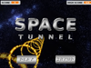
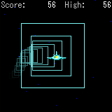

# Space Tunnel

## Scratch (2015)

To play:

- https://scratch.mit.edu/projects/45921906/
- http://phosphorus.github.io/#45921906

To view the source code:

- https://rawgit.com/helderman/spacetunnel/master/scratch/index.html
- http://scratchblocks.github.io/generator/#project=45921906

## Android (2010)

Source code:

- https://github.com/helderman/spacetunnel/tree/master/android

## i-mode (2006) and Java Applet (2007)

Web site:

- http://www.dojadragon.com/?doc=st

Source code:

- https://github.com/helderman/spacetunnel/tree/master/i-mode
- https://github.com/helderman/spacetunnel/tree/master/java-applet
